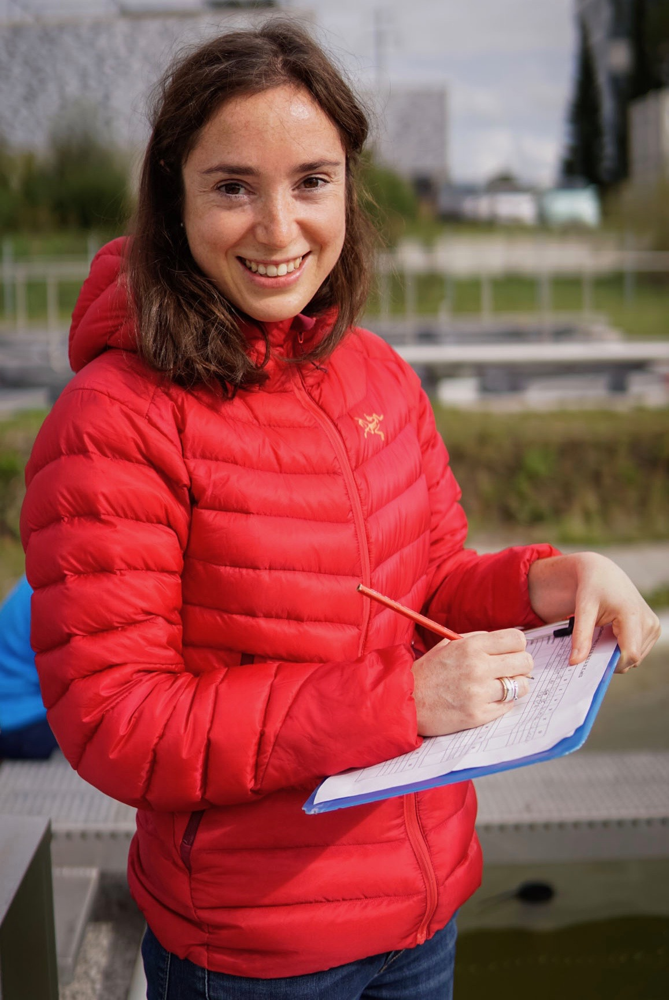
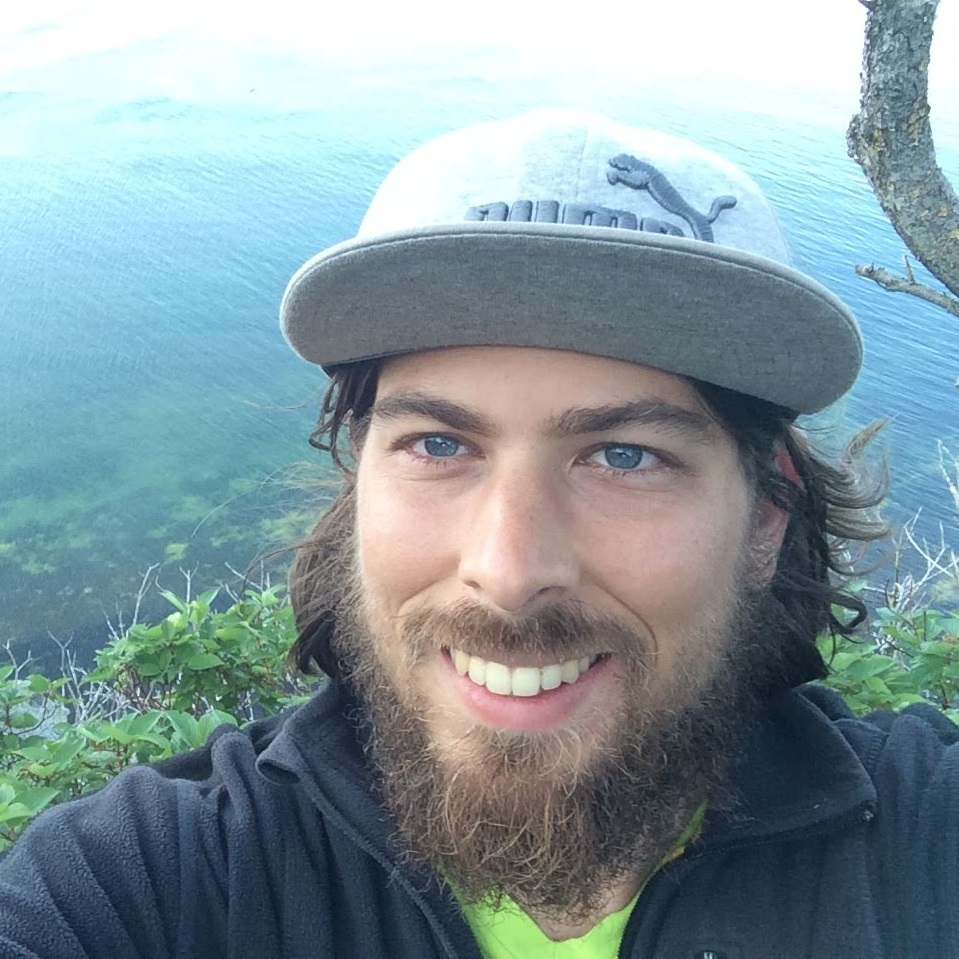

This series of tutorials were produced during a working group hosted by the Living Data Project, lead by Jennifer Sunday and Joey Bernhardt.

They are based on Canadian open datasets with accompanying R code that can be used to teach/illustrate ecological and evolution concepts, and are designed to illustrate and support exploration on a variety of core concepts aimed for undergraduate courses in ecology and evolution.

# Meet our team!

These are the amazing tutorial authors:

#### Joey Bernhardt

 Twitter: @joeybernhardt Github: @joeybernhardt

#### Maxime Fraser Franco

Twitter: @MFraserFranco Github: @quantitative-ecologist

#### Egor Katkov

Twitter: <https://twitter.com/egorkatkov1>

GitHub: <https://github.com/ekatko1>

ResearchGate: <https://www.researchgate.net/profile/Egor-Katkov>

#### Maggie Slein 

Twitter: @sleinma
Github: @mslein